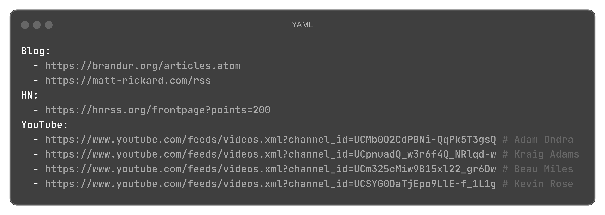
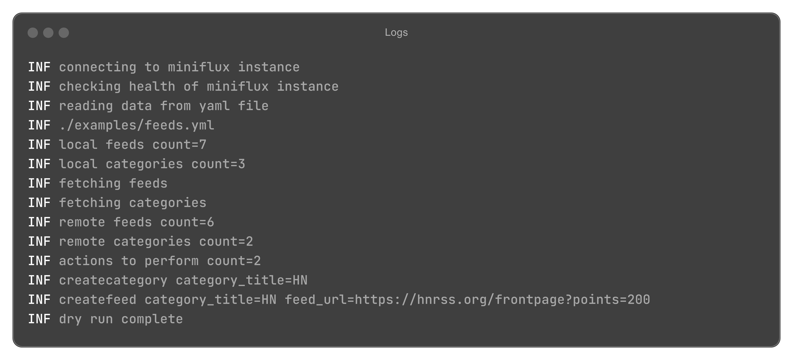

# miniflux-sync

Manage and sync your [Miniflux](https://github.com/miniflux/v2) feeds with YAML.




## Install

> [!IMPORTANT]
> This project is yet to make a release.

## Usage

Configure the CLI to use and authenticate with your Miniflux instance:

```bash
# Use environment variables
MINIFLUX_SYNC_ENDPOINT=... MINIFLUX_SYNC_API_KEY=... miniflux-sync -h

# Or via CLI flags
miniflux-sync --endpoint="..." --api-key="..." -h
```

Then run the CLI:

```bash
# Help
miniflux-sync -h

# View changes via dry run
miniflux-sync sync --path ./feeds.yml --dry-run

# Sync changes
miniflux-sync sync --path ./feeds.yml

# Export remote state
miniflux-sync dump
```

## Contributing

Contributions, issues and feature requests are very welcome.

```bash
# Running tests
go test -cover ./...
```
