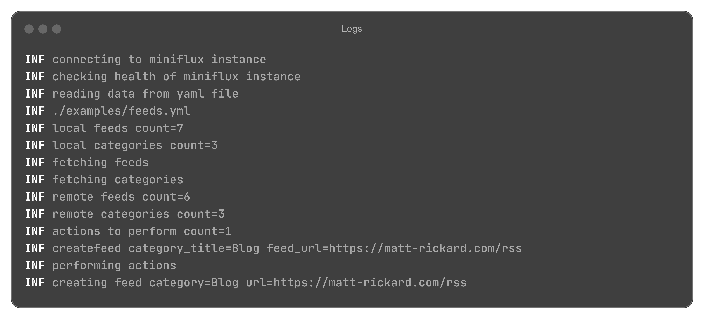

<h1 align="center">miniflux-sync</h1>

<p align="center">
  Manage and sync your <a href="https://github.com/miniflux/v2">Miniflux</a> feeds with YAML.
</p>

<p align="center">
  
  
</p>

## Install

> [!IMPORTANT]
> This project is yet to make a release.

## Usage

```bash
# Help
miniflux-sync -h

# View changes via dry run
miniflux-sync sync --path ./feeds.yml --dry-run

# Sync changes
miniflux-sync sync --path ./feeds.yml

# Export remote state
miniflux-sync dump
```

## Contributing

Contributions, issues and feature requests are very welcome.

```bash
# Running tests
go test -cover ./...
```
